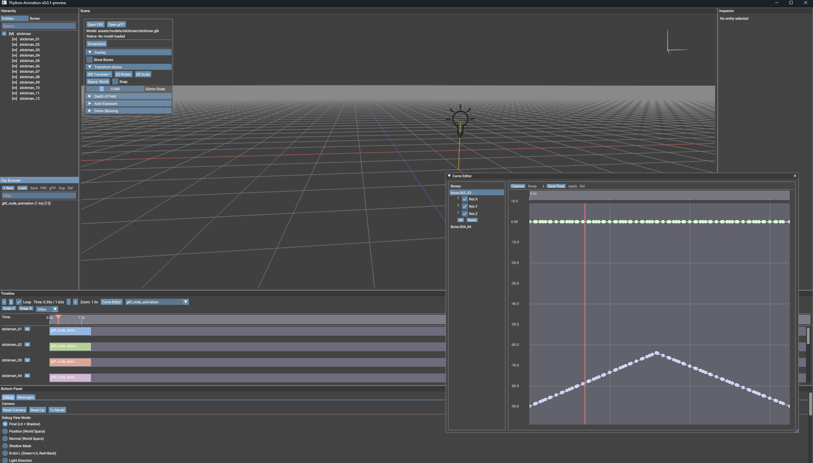

# Thyllore Animation

A real-time animation editing tool powered by ECS architecture, built in Rust with Vulkan.

Import animation model files (glTF / FBX), edit animation curves on a timeline with Bezier interpolation, and export the result back to glTF / FBX. An ML-powered curve copilot suggests keyframe values as you work.



## Features

- **Import / Export** — Load glTF and FBX models, edit animations, and export back to both formats
- **Timeline & Curve Editor** — Keyframe editing with Bezier interpolation and onion skinning
- **ML Curve Copilot** — ONNX-based model that suggests animation curves as you edit
- **Vulkan Rendering** — Deferred pipeline with ray tracing, bloom, tone mapping, and depth of field
- **ECS Architecture** — Data-driven design inspired by Bevy Engine

See [docs/features.md](docs/features.md) for a full list of features.

## Roadmap

See [docs/roadmap.md](docs/roadmap.md) for planned features including rig propagation, text-to-motion, and more.

## Prerequisites

### Rust

Rust 1.70 or later is required.

```bash
# Install Rust via rustup (https://rustup.rs)
curl --proto '=https' --tlsv1.2 -sSf https://sh.rustup.rs | sh
```

### Vulkan SDK

This project requires the [Vulkan SDK](https://vulkan.lunarg.com/sdk/home) for the graphics backend.

#### Windows

1. Download the installer from [LunarG Vulkan SDK](https://vulkan.lunarg.com/sdk/home#windows)
2. Run the installer and follow the prompts
3. Verify installation:
   ```powershell
   vulkaninfo
   ```

#### Linux (Ubuntu / Debian)

```bash
# Add LunarG package repository
wget -qO- https://packages.lunarg.com/lunarg-signing-key-pub.asc | sudo tee /etc/apt/trusted.gpg.d/lunarg.asc
sudo wget -qO /etc/apt/sources.list.d/lunarg-vulkan-jammy.list https://packages.lunarg.com/vulkan/lunarg-vulkan-jammy.list
sudo apt update

# Install Vulkan SDK
sudo apt install vulkan-sdk

# Install additional dependencies
sudo apt install libxcb-render0-dev libxcb-shape0-dev libxcb-xfixes0-dev libxkbcommon-dev
```

#### macOS

```bash
# Install via Homebrew
brew install --cask vulkan-sdk
```

Or download from [LunarG Vulkan SDK](https://vulkan.lunarg.com/sdk/home#mac).

### GPU Driver

A Vulkan-compatible GPU and up-to-date graphics driver are required:

- **NVIDIA**: [Driver download](https://www.nvidia.com/Download/index.aspx)
- **AMD**: [Driver download](https://www.amd.com/en/support)
- **Intel**: [Driver download](https://www.intel.com/content/www/us/en/download-center/home.html)

Verify your GPU supports Vulkan:

```bash
vulkaninfo --summary
```

## Build

```bash
# Clone the repository
git clone https://github.com/kodai731/Thyllore-Animation.git
cd Thyllore-Animation

# Build
cargo build

# Build (release)
cargo build --release
```

### Feature Flags

| Feature | Default | Description |
|---------|---------|-------------|
| `ml` | Yes | ML-based curve copilot (requires ONNX Runtime) |
| `text-to-motion` | No | Text-to-motion generation via gRPC |

```bash
# Build without ML feature (no ONNX Runtime dependency)
cargo build --release --no-default-features

# Build with text-to-motion
cargo build --features text-to-motion
```

#### Building without ML

The `ml` feature requires ONNX Runtime (`onnxruntime.dll` on Windows). If you do not need
the ML curve copilot, build without it:

```bash
cargo build --release --no-default-features
```

This removes the ONNX Runtime dependency entirely. The resulting binary does not require
`onnxruntime.dll` or any `.onnx` model files at runtime.

## Run

```bash
# Run with debug logging
RUST_LOG=debug cargo run --bin thyllore-animation

# Run release build
cargo run --release --bin thyllore-animation
```

## Testing

```bash
# Library tests (recommended)
cargo test --lib

# Integration tests (must disable ml feature)
cargo test --test ecs_tests --no-default-features

# All tests without ml
cargo test --no-default-features
```

> **Note**: Do NOT run `cargo test --test ecs_tests` without `--no-default-features`. The ONNX Runtime dependency causes integration test crashes. See [CLAUDE.md](CLAUDE.md) for details.

## Keyboard Shortcuts
See [docs/keyboard_shortcuts.md](docs/keyboard_shortcuts.md)

## Project Structure
See [docs/structure.md](docs/structure.md)

## Dependencies

Key dependencies used in this project:

| Crate | Purpose |
|-------|---------|
| [vulkanalia](https://crates.io/crates/vulkanalia) | Vulkan API bindings |
| [winit](https://crates.io/crates/winit) | Cross-platform windowing |
| [gltf](https://crates.io/crates/gltf) | glTF model loading |
| [ufbx](https://crates.io/crates/ufbx) | FBX model loading |
| [imgui](https://github.com/imgui-rs/imgui-rs) | Immediate mode GUI |
| [cgmath](https://crates.io/crates/cgmath) | Linear algebra |
| [ort](https://crates.io/crates/ort) | ONNX Runtime (ML inference) |

## Supported Platforms

| Platform | Status |
|----------|--------|
| Windows 10/11 | Primary target |
| Linux (X11) | Supported |
| macOS (MoltenVK) | Untested |

## License

Licensed under the Apache License, Version 2.0. See [LICENSE](LICENSE) for details.
